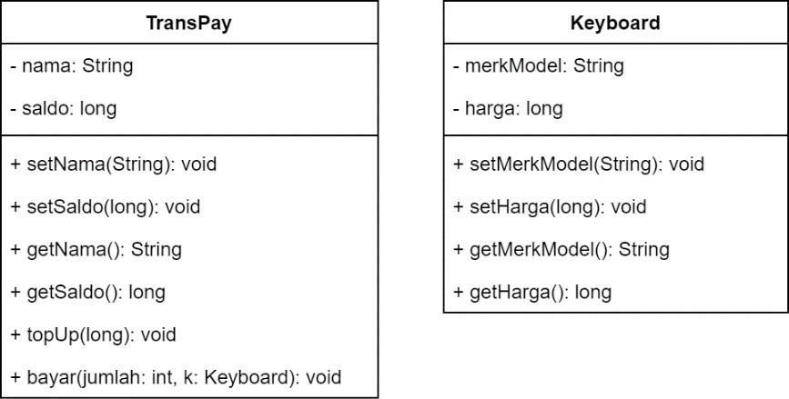
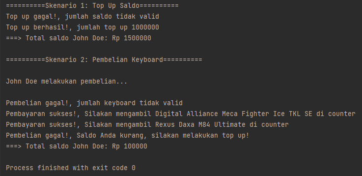

# Access Modifier & Static Field, Method, EncapsulationSoal
Trans adalah toko penyedia keyboard paling lengkap di Solo. Anda sebagai seorang
programmer yang handal diminta oleh toko Trans untuk membuat dompet digital bernama
TransPay. Dompet digital ini dapat digunakan untuk membeli keyboard yang ada pada toko
tersebut. Perhatikan dua class diagram berikut ini  

**Buatlah class TransPay dan class Keyboard** sesuai dengan class diagram di atas. Class
TransPay akan berperan sebagai dompet digital, sedangkan class Keyboard akan berperan
sebagai barang yang dapat dibeli oleh user **(perhatikan class Main)**. Berikut adalah
beberapa hal yang perlu Anda perhatikan dalam membuat class TransPay:
- **Top up hanya berhasil apabila saldo bernilai lebih dari 0.**
- **Pembayaran baru dapat dilakukan apabila dua kondisi berikut ini
  terpenuhi, yaitu:**
  - Jumlah barang yang dibeli lebih dari 0. Jika tidak terpenuhi maka
    tampilkanketerangan input jumlah tidak valid.
  - Jika harga keyboard kurang dari nol maka otomatis harga keyboard
    akan menjadi nol.
  - Total biaya pembelian keyboard (jumlah*harga keyboard) kurang dari atau
    samadengan saldo pembeli. Jika tidak terpenuhi, tampilkan keterangan
    pembayaran gagal.
(Hint: Dalam method bayar(jumlah: int, k: Keyboard) terdapat object k dari class
Keyboard. Anda harus memanfaatkan/memanggil getter untuk mengakses atribut
harga dan merkModel dari object k tersebut agar dapat melakukan pengecekan,pengurangan saldo, dan menampilkan output)
Anda tidak perlu mengurangi maupun menambahkan apapun dari class Main. Jalankan
program Main untuk melakukan serangkaian pengujian. Berikut adalah output yang
diharapkan dari program Anda:  
  

### Poin Penilaian untuk Soal 1:
- PROGRAM BERHASIL DICOMPILE: gunakan mvn compile (Poin 10)
- TEST CASE 1: Class TransPay dan class Keyboard memiliki atribut dan method yang sesuai dengan class diagram. (Poin 20)
- TEST CASE 2: Method untuk melakukan top up terimplementasi dengan baik  dilihat berdasarkanpengujian pada skenario 1. (Poin 20)
- TEST CASE 3: Method untuk melakukan pembayaran terimplementasi dengan baik dilihatberdasarkan pengujian pada skenario 2. (Poin 20)
- TEST CASE 4: eksekusi mvn test melalui terminal berhasil dan tidak ada error. (Poin 30)